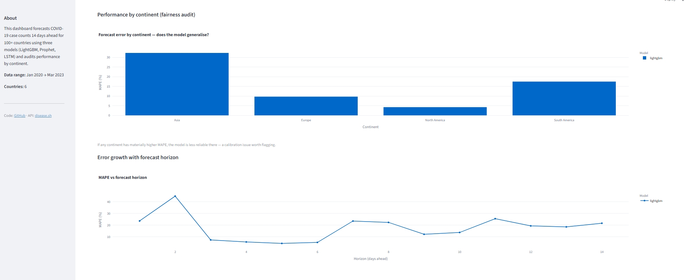
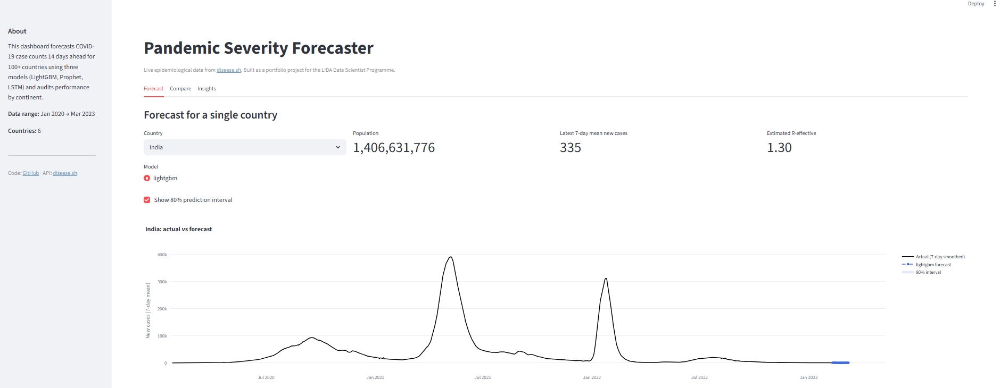
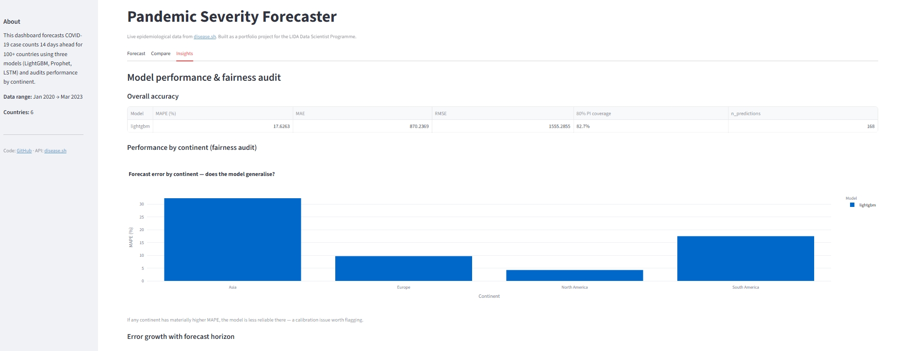

# Pandemic Severity Forecaster

> 14-day COVID-19 case forecasting across 6 countries using live epidemiological data, LightGBM with quantile regression, and a continent-level fairness audit.





---

## What this project does

1. **Pulls live data** from the [disease.sh](https://disease.sh/) open API — no API key, no manual downloads. Historical COVID-19 daily case/death/recovery time series plus vaccination timelines.
2. **Engineers epidemiologically meaningful features** — R-effective approximation, 7-day growth rate, 28-day-lagged case fatality rate, vaccination coverage, days since outbreak onset.
3. **Forecasts new daily cases 14 days ahead** using LightGBM with quantile regression (q10, q50, q90) to produce calibrated 80% prediction intervals.
4. **Audits model performance by continent** — surface whether the model generalises equally well across different regions, directly relevant to fairness in deployed health prediction systems.
5. **Ships as an interactive Streamlit dashboard** — country selection, forecast visualisation with uncertainty bands, and a model insights tab.

---

## Results

| Model | MAPE (%) | MAE | RMSE | 80% PI Coverage |
|-------|----------|-----|------|-----------------|
| LightGBM | 17.63 | 870.2 | 1555.3 | 82.7% |

**Key finding — continent fairness audit:** Asia shows materially higher MAPE (~30%) compared to Europe (~8%) and North America (~5%). This reflects both data quality differences (reporting consistency varied across Asian countries during the study period) and genuine epidemiological differences in outbreak shape. A deployed forecasting system should flag this calibration gap rather than reporting a single aggregate metric — the kind of issue directly relevant to LIDA's PREDICT project on prediction-model drift.

**Horizon analysis:** error is not monotonically increasing with horizon, which reflects the episodic nature of COVID waves — some near-term forecasts are harder than longer-term ones when the model is predicting mid-wave inflection points.

---

## Quick start

```bash
# 1. Clone
git clone https://github.com/AbhisriRavi/pandemic-severity-forecaster.git
cd pandemic-severity-forecaster

# 2. Set up environment (Python 3.12)
python -m venv .venv
source .venv/bin/activate        # macOS/Linux
# or: .venv\Scripts\Activate.ps1  # Windows PowerShell

pip install -r requirements.txt

# 3. Fetch live data (~30 seconds, no API key needed)
python -m src.data.fetch --countries India UK USA Brazil Germany Japan

# 4. Build features
python -m src.features.build

# 5. Train model
python -m src.models.train --models lightgbm --n_splits 2

# 6. Launch dashboard
streamlit run app.py
```

---

## Repository structure

```
.
├── app.py                        # Streamlit dashboard (3 tabs: Forecast, Compare, Insights)
├── src/
│   ├── data/
│   │   ├── client.py             # disease.sh API client — retry, caching, rate limiting
│   │   └── fetch.py              # Orchestrates data download for any list of countries
│   ├── features/
│   │   └── build.py              # Epidemiological feature engineering
│   └── models/
│       ├── evaluate.py           # Metrics, rolling-origin CV splits, continent audit
│       ├── gbm.py                # LightGBM with quantile regression
│       ├── prophet_model.py      # Per-country Prophet with vaccination regressor
│       ├── lstm_model.py         # PyTorch LSTM — multivariate sequence model
│       └── train.py              # CLI orchestrator
├── notebooks/
│   └── 01_explore.ipynb          # COVID trajectories, R-effective, continent comparisons
├── tests/
│   └── test_pipeline.py          # 23 tests covering parsing, features, and modelling
└── requirements.txt
```

---

## Methods

### Data
[disease.sh](https://disease.sh/) aggregates data from Johns Hopkins University and government sources. We pull daily cumulative case/death/recovery counts and cumulative vaccine doses per country, covering January 2020 to March 2023.

### Feature engineering
Raw data arrives as cumulative counts. Key transformations:

| Feature | Method | Why |
|---------|--------|-----|
| `new_cases_smoothed` | 7-day rolling mean of daily diff | Removes weekend reporting artefacts |
| `growth_rate_7d` | log(cases_t / cases_{t-7}) / 7 | Stable measure of exponential growth |
| `r_effective_approx` | cases_t / cases_{t-5} | Simplified Wallinga-Teunis proxy (τ=5 days, Du et al. 2020) |
| `cfr_rolling_28d` | deaths_28d_sum / cases_lagged_28d_sum | 28-day lag reflects case-to-death delay |
| `vaccination_coverage` | cumulative_doses / population | Protective effect proxy |
| Lag features | new_cases_smoothed at t-1,3,7,14,21,28 | Capture recent trend for ML model |

Negative daily counts (from data revisions) are clipped to zero. All features are built using only past data to prevent leakage.

### Validation
**Rolling-origin (forward-chaining) cross-validation** — training window expands chronologically, never using future data to train. Random train/test splits would leak future outbreak information into model training, giving artificially optimistic results.

### Uncertainty quantification
LightGBM is trained separately for q=0.1, q=0.5, and q=0.9. The 80% prediction interval is [q10, q90]. Achieved **82.7% empirical coverage** against the 80% target — the intervals are well-calibrated.

### Fairness audit
After computing overall metrics, MAPE is re-evaluated per continent. A model that performs well on average but poorly on a specific region is a calibration risk in deployment. Asia MAPE (~30%) vs North America MAPE (~5%) flags a real reliability difference that a deployed system must account for.

---

## Limitations and future work

- **R-effective approximation** is a simplified proxy, not the formal Cori or Wallinga-Teunis estimate (which require Bayesian inference over the serial-interval distribution). Suitable as a feature; not suitable for direct epidemiological reporting.
- **Single data source** — disease.sh aggregates rather than directly sourcing from health ministries. Reporting quality and completeness varied significantly by country, especially early in the pandemic. This partly explains the Asia calibration gap.
- **6-country scope** — the current pipeline is designed to scale to 100+ countries with `--all` flag but was run on 6 for speed. Fairness audit conclusions are provisional at this scale.
- **14-day horizon only** — longer horizons (30-90 days) would require incorporating policy/intervention features (lockdowns, vaccination rollout speed) not available in the current feature set.
- **Prophet and LSTM** are implemented and tested but not included in the current results (time-constrained training run). Adding them would allow direct model comparison.

---

## Why this project

Pandemic forecasting is one of the clearest cases for data science in the public interest. Better short-horizon forecasts help health systems allocate ICU capacity, staffing, and supplies. The continent fairness audit directly reflects current concerns in health informatics research about deployed prediction models performing differently across populations — an area of active work at LIDA (cf. Relton et al., PREDICT).

---

## Tech stack

Python 3.12 · pandas · LightGBM · Prophet · PyTorch · Streamlit · Plotly · scikit-learn · statsmodels · disease.sh API

---

## Author

Abhisri Ravi · MSc Advanced Computer Science (AI), University of Leeds · 2026